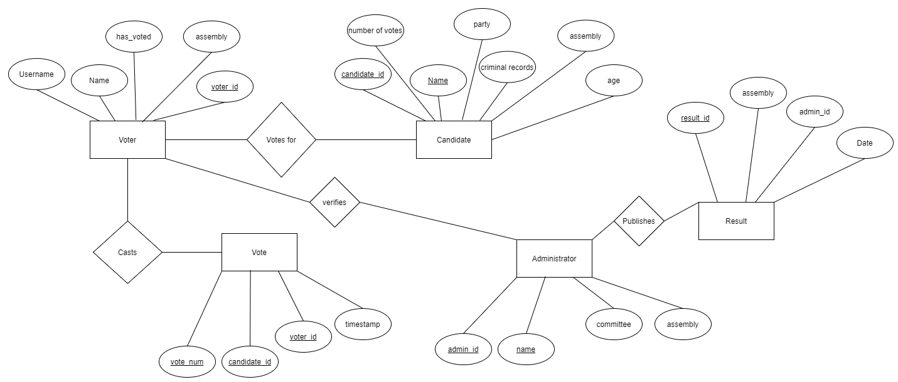
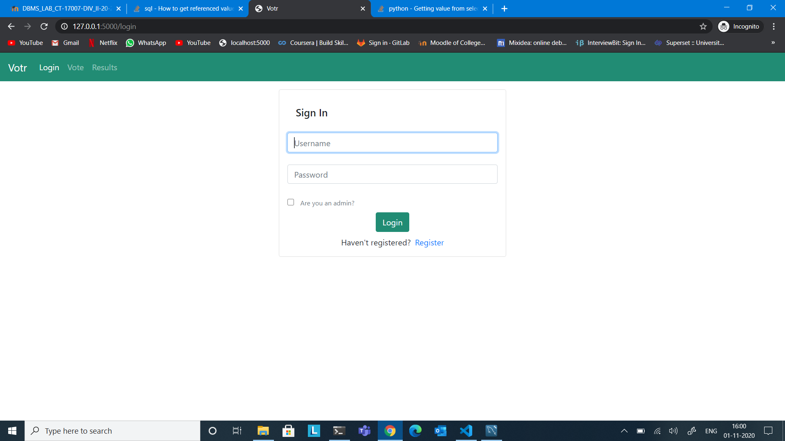
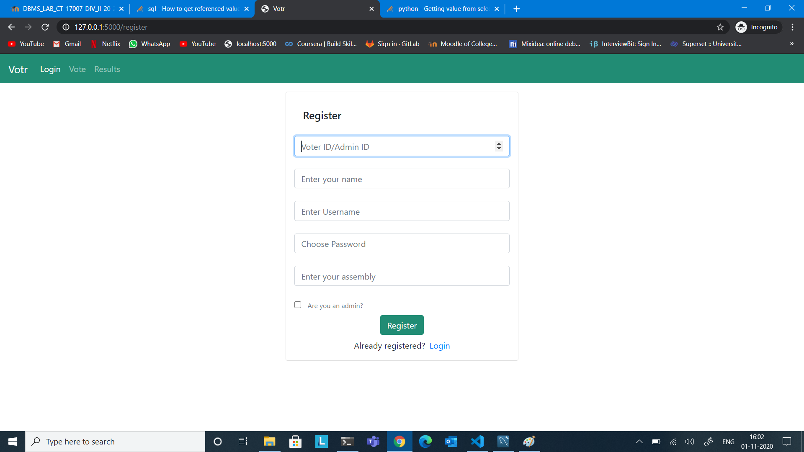
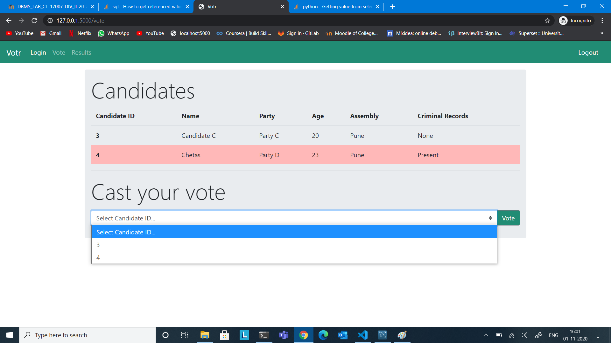
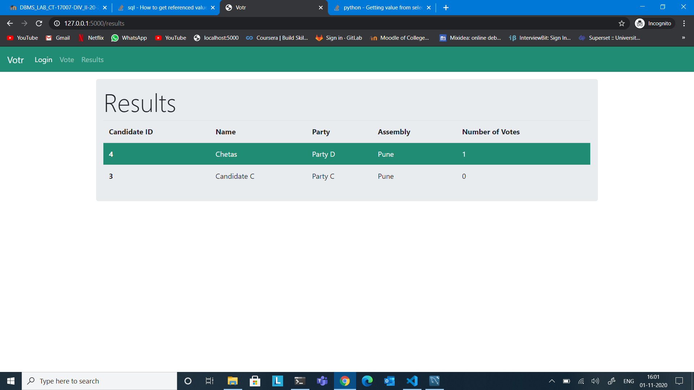
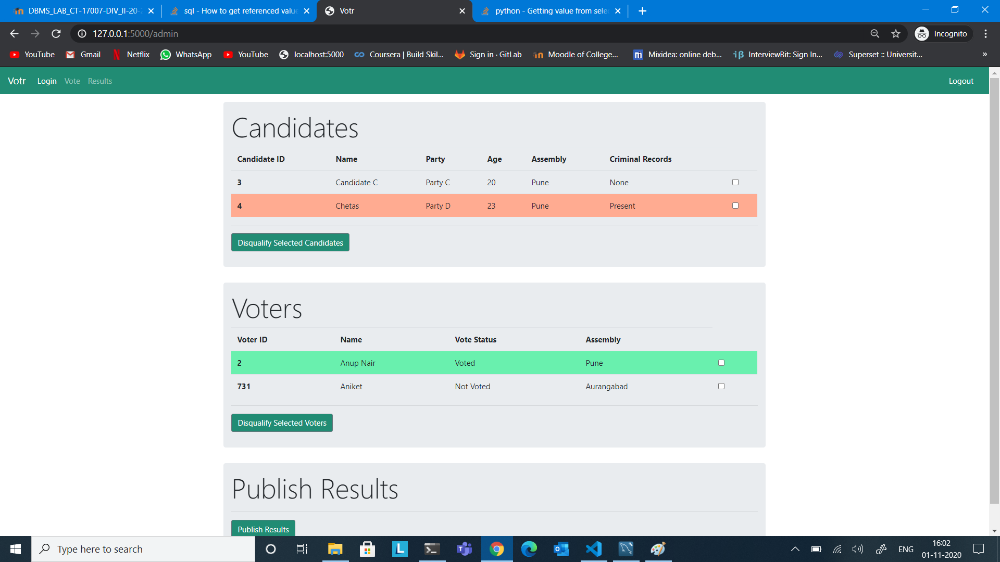

<b>A database schema for E Voting System.</b>

```
MIS: 111809044
Name: Aniket Jayateerth
Class: TY B.Tech
Division: 2
Batch: T4
```

<hr>

#### Project Description:

<p>This is a simple evoting system where voters can login using their voter ids and cast votes for their favourite candidates.
This is especially useful in situations like a pandemic where voter turn out is likely to be low. An online voting system is not only convenient but also the need of the hour. Most elections are cumbersome and require a lot of capital investment. If the process is held online, it would be easier for people to vote and with appropriate security system, fair and transparent elections can be held. This database defines the general schema that would be required if such a system were in place.</p>

<hr>

#### ER Diagram



<hr>

#### Tech Stack Used:

```
Programming Languages:
1. Python 3.8.5
2. HTML5.1
3. CSS3 (Bootstrap)
4. SQL 8.0.2.1

Frameworks:
1. MySQL
2. Flask
3. flask-mysql
```

<hr>

##### Installation guide:

Use the package manager [pip](https://pip.pypa.io/en/stable/) to install evoting.

```
git clone https://github.com/andipro123/e-voting_DBMS.git

Install the dependencies
pip install -r requirements.txt

Run the app

cd e-voting/
python ./app.py

```

<hr>

## Features:

1. <b>Admin</b>

```
1. Can verify voters and their details
2. Can verify candidates and their details
3. Can disqualify candidates and voters
4. Publish results of election
5. Overlook data and integrity of the process
```

2. <b>Voter</b>

```
1. Can login/register into the system
2. Can choose and view candidates who have stood for election
3. Can cast their vote
4. View results after admin publishes them.

```

<hr></hr>

# Screenshots

<h3>Login</h3>
  
  

 <hr></hr>

 <h3>Register</h3>

  

  <hr></hr>

<h3>Vote</h3>
  
  <hr></hr>

<h3>Results</h3>
  
  <hr></hr>

<h3>Admin</h3>
  
  <hr></hr>
